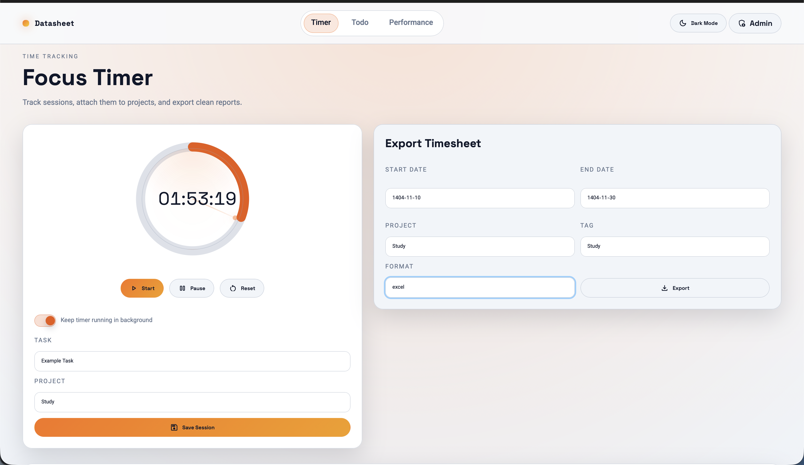

# Datasheet Manager

A focused time tracking and task management workspace built with Django. It includes a timer, projects, tags, a Kanban-style todo board, performance charts, and exportable timesheets. The UI supports light/dark themes and HTMX-powered interactions.



## Features

- Timer with start, pause/resume, reset, and background persistence
- Projects and tags for structured time tracking
- Todo board with statuses (Todo, Doing, Done)
- Parent tasks and subtasks
- Work logs per task with unlimited entries
- Search tasks by title, details, or project
- Performance dashboard with daily and monthly breakdowns
- CSV and Excel export for timesheets
- Light and dark theme toggle

## Tech Stack

- Django 5
- HTMX for partial updates
- Chart.js for charts
- Jalali date support
- WhiteNoise for static files in production

## Project Structure

- `datasheet/` Django project configuration
- `timer/` Timer, exports, performance
- `todo/` Todo board, subtasks, work logs
- `static/` Frontend assets
- `templates/` HTML templates

## Setup (Local)

### 1. Create a virtual environment

```bash
python3 -m venv .venv
source .venv/bin/activate
```

### 2. Install dependencies

```bash
pip install -r requirements.txt
```

### 3. Environment configuration

Create a `.env` file next to `manage.py`:

```env
DJANGO_SECRET_KEY=replace-me
DJANGO_DEBUG=True
DJANGO_ALLOWED_HOSTS=127.0.0.1,localhost
DJANGO_CSRF_TRUSTED_ORIGINS=
```

### 4. Run migrations

```bash
python3 manage.py migrate
```

### 5. Create admin user (optional)

```bash
python3 manage.py createsuperuser
```

### 6. Start the server

```bash
python3 manage.py runserver
```

Open: `http://127.0.0.1:8000/`

## Docker

### Build

```bash
docker build -t datasheet-manager .
```

### Run

```bash
docker run -p 8000:8000 \
  -e DJANGO_SECRET_KEY=replace-me \
  -e DJANGO_ALLOWED_HOSTS=localhost,127.0.0.1 \
  datasheet-manager
```

Open: `http://127.0.0.1:8000/`

## Usage

### Timer

1. Start the timer.
2. Add task details and choose a project.
3. Save the session to store the record.
4. Export records when needed.

### Todo Board

1. Create tasks with optional project and parent task.
2. Add work logs per task from the task detail modal.
3. Move items across Todo, Doing, and Done.
4. Search tasks from the search modal.

### Performance

- View daily and monthly breakdowns.
- Each project is visualized via a chart segment.

## Environment Variables

- `DJANGO_SECRET_KEY` (required in production)
- `DJANGO_DEBUG` (True/False)
- `DJANGO_ALLOWED_HOSTS` (comma-separated)
- `DJANGO_CSRF_TRUSTED_ORIGINS` (comma-separated)

## License

GNU General Public License v3.0 (GPL-3.0). See `LICENSE`.
